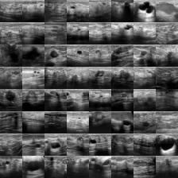
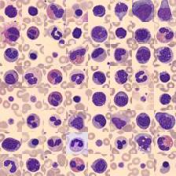

# AMLS_assignment24_25
## Project Overview
This project is part of the AMLS assignment for the academic year 2024-2025. It involves developing machine learning models to solve classification tasks using two datasets: BreastMNIST and BloodMNIST.

### BreastMNIST
- **Description**: BreastMNIST comprises grayscale ultrasound images of breast tumors, each with a 28x28 pixel resolution. Images are labeled as "Benign" (noncancerous) or "Malignant" (cancerous), making it suitable for binary classification tasks focused on breast cancer detection.
- **Dataset Split**: 546 images for Training, 78 for Validation, and 156 for Testing.
- **Application**: To be used for Task A.

<p align="center">
    
</p>
<p align="center"><b>Figure 1: BreastMNIST Training Montage</b></p>

### BloodMNIST
- **Description**: BloodMNIST contains images from blood slides used for classifying blood cells into eight distinct classes, making it valuable for multi-class classification in clinical contexts. Each image is resized to 28x28 pixels for compatibility with machine learning models.
- **Dataset Split**: 11,959 images for Training, 1,715 for Validation, and 3,421 for Testing.
- **Application**: To be used for Task B.

<p align="center">
    
</p>
<p align="center"><b>Figure 2: BloodMNIST Training Montage</b></p>


The datasets are accessible at [MedMNIST](https://medmnist.com/).

In this project, four models were trained for these classification tasks: ResNet18, Vision Transformer (ViT), Support Vector Machine (SVM), and Random Forest. The ViT model is based on the implementation from this [ViT Pytorch project](https://github.com/lucidrains/vit-pytorch).

## File Descriptions
### Root Directory
```plaintext
├── A
│   ├── A_main.py          # Main script for Task A.
│   ├── A_model            # Directory containing trained models and related files for Task A.
│   │   ├── ResNet18_2024-12-25 15:09:51.435892  # Directory for ResNet18 model trained on 2024-12-25.
│   │   ├── SVM_2024-12-25 17:47:43.290416       # Directory for SVM model trained on 2024-12-25.
│   │   └── ViT_2024-12-25 15:12:32.084710       # Directory for ViT model trained on 2024-12-25.
│   ├── __init__.py         # Initialization file for the A module.
│   ├── docs                # Documentation and images related to Task A.
│   │   └── breastmnist_train_montage.jpg  # Montage of training images for BreastMNIST.
│   └── model.py            # Model definitions for Task A.
├── B
│   ├── B_main.py          # Main script for Task B.
│   ├── B_model            # Directory containing trained models and related files for Task B.
│   │   ├── ResNet18_2024-12-25 15:20:01.738181  # Directory for ResNet18 model trained on 2024-12-25.
│   │   ├── RF_2024-12-25 18:10:31.138830        # Directory for Random forest model trained on 2024-12-25.
│   │   └── ViT_2024-12-25 15:36:47.570820       # Directory for ViT model trained on 2024-12-25.
│   ├── __init__.py         # Initialization file for the B module.
│   ├── docs                # Documentation and images related to Task B.
│   │   └── bloodmnist_train_montage.jpg  # Montage of training images for BloodMNIST.
│   └── B_model.py            # Model definitions for Task B.
├── Datasets               # Directory for storing datasets.
├── LICENSE                # License file for the project.
├── README.md              # Project overview and instructions.
├── environment.yml        # Conda environment configuration file.
├── main.py                # Main script to run the project.
└── requirements.txt       # List of required Python packages.
```

## Conda Environment Setup

To set up the conda environment for this project, follow these steps:

1. **Clone the Project Repository**:
    ```bash
    git clone https://github.com/yushiran/AMLS_assignment24_25.git
    ```
    ```bash
    cd AMLS_assignment24_25
    ```

2. **Create the Conda Environment**:
    ```bash
    conda env create -f environment.yml
    ```

3. **Activate the Conda Environment**:
    ```bash
    conda activate amls-final
    ```

This will ensure that all necessary packages and dependencies are installed and the environment is ready for use.

## Run the project
To test the project, you can run the main script using Python. Make sure you have activated the conda environment as described above. Then, execute the following command:

```bash
python main.py
```

This will start the process and run the necessary scripts for both Task A and Task B, utilizing the trained models to perform the classification tasks.

## Experimental Results

| Task  | Model       | AUC           | Accuracy       |
|-------|-------------|---------------|----------------|
| Task A| ResNet18    | 0.8759398496240602 | 0.8589743589743589 |
| Task A| ViT         | 0.7410192147034252 | 0.7692307692307693 |
| Task A| SVM         | 0.6904761904761906 | 0.7564102564102564 |
| Task B| ResNet18    | 0.9973645786078182 | 0.9555685472084186 |
| Task B| ViT         | 0.9828683449477108 | 0.8517977199649225 |
| Task B| RF          | 0.9742410136198443 | 0.8310435545162234 |
